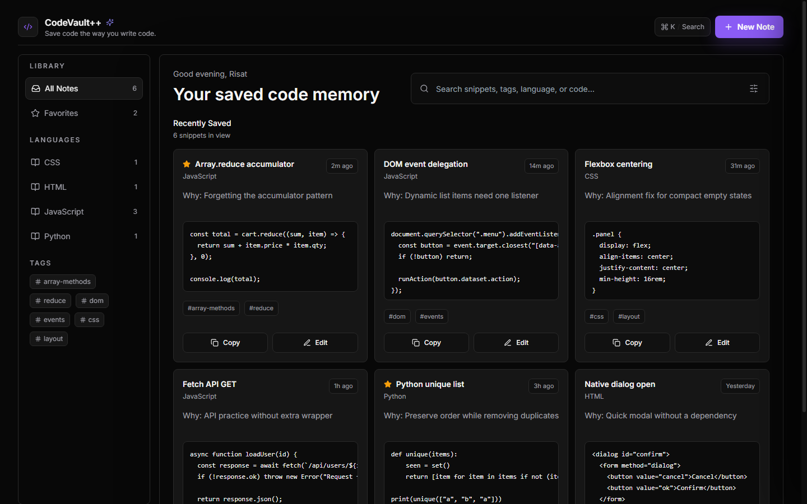

# CodeVault - Developer Code Notebook

CodeVault is a dark, searchable **code snippet manager** and **developer notebook** for saving reusable code notes, explanations, tags, and syntax-highlighted snippets. It is a lightweight **React code notes app** built as a **Vite React Tailwind app** for developers who want a fast personal **code vault**.

## Live Demo

Live demo URL will be added after the Cloudflare Pages deployment finishes.

Contributors should preview the live demo first, then run the project locally before opening a pull request.

## Screenshot Preview



## Features

- Save reusable code notes with title, reason, language, tags, and snippet body
- Search across note metadata and optional code content
- Browse searchable code snippets by language, collection, and tags
- Edit notes in a right-side drawer with syntax highlighting
- Copy snippets quickly from preview cards
- Responsive dark UI designed for developer workflows
- Alpha roadmap for persistence, deletion, import/export, and toast feedback

## Tech Stack

- Vite
- React
- Tailwind CSS
- Ace Editor for syntax highlighting
- Lucide React icons

## Roadmap

- Add localStorage persistence
- Add note deletion
- Add copy success toast notification
- Add save success toast notification
- Add JSON export feature
- Add JSON import feature
- Improve mobile sidebar experience
- Add Ctrl+N / Cmd+N shortcut for new note

## Installation

Clone the repository:

```bash
git clone https://github.com/sayedrisat/codevault.git
cd codevault
```

Install dependencies:

```bash
npm install
```

Start the local development server:

```bash
npm run dev
```

Open the local Vite URL shown in your terminal, usually:

```txt
http://localhost:5173
```

Build for production:

```bash
npm run build
```

Preview the production build:

```bash
npm run preview
```

## Usage

1. Open CodeVault in your browser.
2. Use the search bar to find saved snippets by title, tag, language, explanation, or code body.
3. Select a language or tag from the sidebar to narrow the list.
4. Click **New Note** to create a reusable code note.
5. Add a short reason for saving the snippet so it is easier to remember later.
6. Use **Copy** on a note card to copy the snippet.
7. Use **Edit** to open the drawer editor and update a note.

## Previewing Pull Requests Locally

Before reviewing or opening a pull request, preview the live demo first, then run the project locally:

```bash
git clone https://github.com/sayedrisat/codevault.git
cd codevault
npm install
npm run dev
```

Open the local Vite URL shown in your terminal, usually:

```txt
http://localhost:5173
```

Before opening a PR, please:

- run `npm run dev`
- test the UI locally
- take a screenshot if your change affects the UI
- mention what you changed in the PR description

## Cloudflare Pages Deployment

CodeVault is prepared for Cloudflare Pages deployment from GitHub.

Recommended Cloudflare Pages settings:

- Framework preset: Vite
- Build command: `npm run build`
- Output directory: `dist`
- Node version: use the version in `.node-version`

## Contributing

Contributions are welcome. Start with a small focused issue, especially one labeled `good first issue`.

Suggested workflow:

1. Pick an issue from the roadmap or GitHub issues.
2. Create a focused branch.
3. Run the app locally.
4. Make a small, reviewable change.
5. Test the affected UI or feature.
6. Add screenshots for UI changes.
7. Open a pull request with a clear before/after explanation.

Read the full contributor guide in [CONTRIBUTING.md](CONTRIBUTING.md).

## Good First Issues

Good first improvements include:

- Add localStorage persistence
- Add note deletion
- Add copy success toast notification
- Improve mobile sidebar behavior
- Update README screenshots

## License

CodeVault is released under the [MIT License](LICENSE).

## Keywords

CodeVault is a frontend project for developers looking for a code snippet manager, developer notebook, React code notes app, code vault, syntax highlighting, searchable code snippets, and a Vite React Tailwind app.
